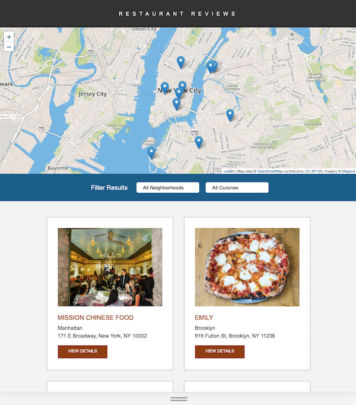

 
# Restaurant Review App  
## Udacity Front-End Nanodegree Project 5 - Introduction

This Restaurant Review App is the last project of the Udacity Front-End Nanodegree and follows the "Restaurant Review project rubric" and the following style guides provided by Udacity:
- CSS Style Guide
- HTML Style Guide
- JavaScript Style Guide
- Git Style Guide

The HTML and CSS files were validated by the following validators:
- [W3C HTML Validator](https://jigsaw.w3.org/css-validator/)
- [W3C CSS Validator](https://validator.w3.org/)

## Overview



## Udacity Specification

- It was provided code for a restaurant reviews website. The code had a lot of issues. It was barely usable on a desktop browser, much less a mobile device. It also didn't include any standard accessibility features, and it didn't work offline at all. My job was to update the code to resolve these issues while still maintaining the included functionality.
 
## Udacity Requirements

### Responsive Design
- [x] All of the page elements are usable and visible in any viewport, including desktop, tablet, and mobile displays.
- [x] Images don't overlap, and page elements wrap when the viewport is too small to display them side by side.
- [x] Mobile first approach
- [x] There is a viewport meta tag

### Accessibility
- [x] Alt attributes are present and descriptive for images. 
- [x] Screen-reader-only attributes when appropriate to add useful supplementary text. 
- [x] Semantic markup used where possible, and aria attributes when semantic markup is not feasible.
- [x] Logical focus order
- [x] Skip link
- [x] Aria-role where necessary
- [x] High-contrast colors

### Offline Availability
- [x] Cache API and a ServiceWorker, cache the data for the website so that any page (including images) that has been visited is accessible offline.

## How to install and use it?

- Download the files, cd into directory and run:
  ```bash
  npm start 
  ```
  or 
  ```bash
  python -m SimpleHTTPServer 8000
  ```
- Access the server in the browser: http://localhost:8000/
- Filter the restaurants by neighborhood and cuisine
- Chose the desired restaurant and read the reviews  

## References

- [W3 Schools Documentation](https://www.w3schools.com/)
- [MDN Documentation](https://developer.mozilla.org)
- [W3 Org Website](https://www.w3.org/TR/html-aria/#web-developer-requirements-for-use-of-aria-in-html)
- [WebAIM Page Color Contrast Checker](https://webaim.org/resources/contrastchecker/)
- [NPM Documentation](https://docs.npmjs.com/)
- [Intro To Service Workers & Caching Youtube Video](https://www.youtube.com/watch?v=ksXwaWHCW6k)
